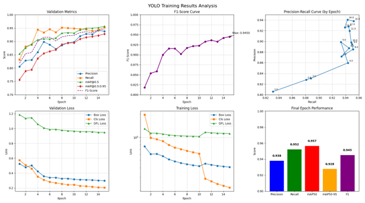
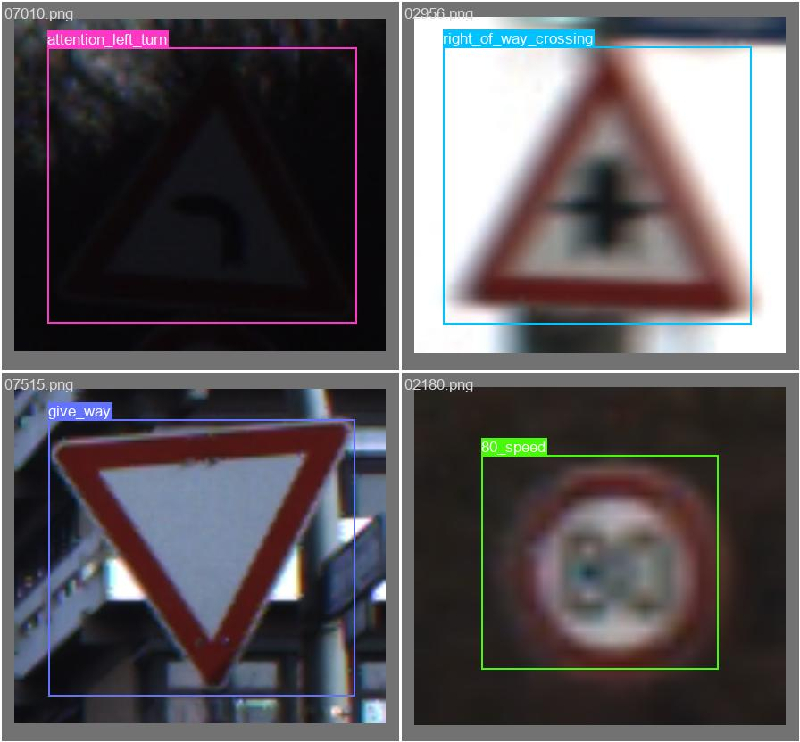

# Weather-Robust Traffic Sign Detection with YOLOv5

[]()
[]()
[]()

This project implements a deep learning pipeline to improve the robustness of traffic sign detection for autonomous vehicles in adverse weather conditions. Using the YOLOv5 architecture and the GTSRB dataset, we explore the impact of synthetic weather augmentations (fog, rain, lighting shifts) on model performance.

** Full Report:** For a comprehensive overview of the methodology, results, and analysis, please see the full project report: [`Custom_Vision_Report.pdf`](Custom_Vision_Report.pdf).

---

##  Project Highlights

- **Model:** YOLOv5s enhanced for robustness.
- **Dataset:** German Traffic Sign Recognition Benchmark (GTSRB).
- **Key Technique:** Synthetic adverse weather augmentation (fog, rain, lighting shifts) during training.
- **Results:** Achieved **0.961 mAP@0.5** and **0.931 mAP@[0.5:0.95]** on the validation set, demonstrating strong detection capabilities under simulated challenging conditions. This shows high precision and recall even with weather distortions.



*Training history showing precision, recall, and mAP curves.*

| Example Validation Results |
| :---: |
|  |

| *Example predictions on validation images.* |

##  Project Structure
Traffic-Sign-Weather-Robustness/

├── config/

│ └── data.yaml # Dataset configuration

├── outputs/ # Results & graphs

│ ├── results.png # Training results graph

│ └── validation_batch.jpg # Validation examples

├── LICENSE

├── README.md

├── requirements.txt

└── Custom_Vision_Report.pdf # Full project report

##  Installation & Usage

1.  **Clone the repository**
    ```bash
    git clone https://github.com/your-username/Traffic-Sign-Weather-Robustness.git
    cd Traffic-Sign-Weather-Robustness
    ```

2.  **View the Results**
    The outcomes of this project, including training metrics and validation examples, are available in the `outputs/` directory. For a comprehensive analysis, please see the full project report: [`Custom_Vision_Report.pdf`](Custom_Vision_Report.pdf).


##  License

This project is licensed under the MIT License - see the [LICENSE](LICENSE) file for details.

##  Acknowledgments

- **GTSRB Dataset:** Stallkamp et al., *The German Traffic Sign Recognition Benchmark*, IJCNN 2011.
- **YOLOv5:** Ultralytics (https://github.com/ultralytics/yolov5)
